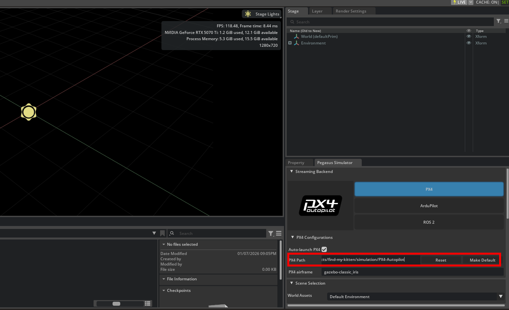

# Installing Isaac Sim, Pegasus Simulator extension, and Running Standalone App
This tutorial is built upon [Pegasus Simulator documentation](https://pegasussimulator.github.io/PegasusSimulator/source/setup/installation.html), repurposed for this project.
This tutorial assumes you have set up find-my-kitten repository locally, as well as ROS2 and QGroundControl.


## Installing Isaac Sim

Run the following commands in terminal to install Isaac Sim:
```
# Go to the home directory
cd ~

# Create a new directory to store the Isaac Sim installation
mkdir -p isaacsim
cd isaacsim

# Download the zip file containing the Isaac Sim installation
wget https://download.isaacsim.omniverse.nvidia.com/isaac-sim-standalone-5.1.0-linux-x86_64.zip

# Unzip the file
unzip isaac-sim-standalone-5.1.0-linux-x86_64.zip

# Run the post-installation scripts, no need to select any options besides default
./post_install.sh
./isaac-sim.selector.sh

# Delete the zip file
rm isaac-sim-standalone-5.1.0-linux-x86_64.zip
```
Done :+1:<br />

## Setting environment variables

Add the following to your `~/.bashrc` file.
```
# ---------------------------
# ISAAC SIM SETUP
# ---------------------------
# Isaac Sim root directory
export ISAACSIM_PATH="${HOME}/isaacsim"
# Isaac Sim python executable
export ISAACSIM_PYTHON="${ISAACSIM_PATH}/python.sh"
# Isaac Sim app
export ISAACSIM="${ISAACSIM_PATH}/isaac-sim.sh"

# Define an auxiliary function to launch Isaac Sim or run scripts with Isaac Sim's python
# This is done to avoid conflicts between ROS 2 and Isaac Sim's Python environment
isaac_run() {

    # ------------------
    # === VALIDATION ===
    # ------------------
    if [ ! -x "$ISAACSIM_PYTHON" ]; then
        echo "❌ IsaacSim python.sh not found at: $ISAACSIM_PYTHON"
        return 1
    fi
    if [ ! -x "$ISAACSIM" ]; then
        echo "❌ IsaacSim launcher not found at: $ISAACSIM"
        return 1
    fi

    # -------------------------
    # === CLEAN ENVIRONMENT ===
    # -------------------------
    # Unset ROS 2 environment variables to avoid conflicts with Isaac's Python 3.11
    unset ROS_VERSION ROS_PYTHON_VERSION ROS_DISTRO AMENT_PREFIX_PATH COLCON_PREFIX_PATH PYTHONPATH CMAKE_PREFIX_PATH

    # Remove ROS 2 paths from LD_LIBRARY_PATH if present
    local ros_paths=("/opt/ros/humble" "/opt/ros/jazzy" "/opt/ros/iron")
    for ros_path in "${ros_paths[@]}"; do
        export LD_LIBRARY_PATH=$(echo "$LD_LIBRARY_PATH" | tr ':' '\n' | grep -v "^${ros_path}" | paste -sd':' -)
    done

    # -----------------------------
    # === UBUNTU VERSION CHECK ===
    # -----------------------------

    if [ -f /etc/os-release ]; then
        UBUNTU_VERSION=$(grep "^VERSION_ID=" /etc/os-release | cut -d'"' -f2)
    fi

    # If Ubuntu 24.04 -> use the Isaac Sim internal ROS2 Jazzy (ROS2 Jazzy bridge)
    if [[ "$UBUNTU_VERSION" == "24.04" ]]; then
        export ROS_DISTRO=jazzy
        export RMW_IMPLEMENTATION=rmw_fastrtps_cpp
        export LD_LIBRARY_PATH="${LD_LIBRARY_PATH}:${ISAACSIM_PATH}/exts/isaacsim.ros2.bridge/jazzy/lib"
        echo "🧩 Detected Ubuntu 24.04 -> Using ROS_DISTRO=jazzy"
    # If Ubuntu 22.04 -> use the Isaac Sim internal ROS2 Humble (ROS2 Humble bridge)
    else
        export ROS_DISTRO=humble
        export RMW_IMPLEMENTATION=rmw_fastrtps_cpp
        export LD_LIBRARY_PATH="${LD_LIBRARY_PATH}:${ISAACSIM_PATH}/exts/isaacsim.ros2.bridge/humble/lib"
        echo "🧩 Detected Ubuntu ${UBUNTU_VERSION:-unknown} -> Using ROS_DISTRO=humble"
    fi

    # ---------------------
    # === RUN ISAAC SIM ===
    # ---------------------
    if [ $# -eq 0 ]; then
        # No args → Launch full Isaac Sim GUI
        echo "🧠 Launching Isaac Sim GUI..."
        "${ISAACSIM}"

    elif [[ "$1" == --* ]]; then
        # Arguments start with "--" → pass them to Isaac Sim executable
        echo "⚙️  Launching Isaac Sim with options: $*"
        "${ISAACSIM}" "$@"

    elif [ -f "$1" ]; then
        # First argument is a Python file → run with Isaac Sim's Python
        local SCRIPT_PATH="$1"
        shift
        echo "🚀 Running Python script with Isaac Sim: $SCRIPT_PATH"
        "${ISAACSIM_PYTHON}" "$SCRIPT_PATH" "$@"

    else
        # Unrecognized input
        echo "❌ Unknown argument or file not found: '$1'"
        echo "Usage:"
        echo "  isaac_run                 → launch GUI"
        echo "  isaac_run my_script.py    → run script with IsaacSim Python"
        echo "  isaac_run --headless ...  → launch IsaacSim with CLI flags"
        return 1
    fi
}
```

Test the current environment by running `isaac_run` in terminal. This should open a new window running Isaac Sim.

Test that the Isaac Sim python interpreter path variable is correct by running in the terminal:</br> 
`$ISAACSIM_PYTHON ${ISAACSIM_PATH}/standalone_examples/api/isaacsim.core.api/add_cubes.py`</br>

## Installing Pegasus Simulator extension
1. Launch Isaac Sim with `isaac_run` in terminal.
2. Open the Window->extensions on the top menubar inside Isaac Sim.

3. On the Extensions manager menu, we can enable or disable extensions. By pressing the settings button, we can add a path to the Pegasus-Simulator repository.

4. The path inserted should be the path to the repository followed by /extensions.

5. After adding the path to the extension, we can enable the Pegasus Simulator extension on the third-party tab. Enable AUTOLOAD.


## Installing the extension as a library

In order to be able to use the Pegasus Simulator API from python scripts and standalone apps, we must install this extension as a pip python module for the built-in ISAACSIM_PYTHON to recognize. For that, run:

```
# Go to the repository of the pegasus simulator
cd PegasusSimulator

# Go into the extensions directory
cd extensions

# Run the pip command using the built-in python interpreter
$ISAACSIM_PYTHON -m pip install --editable pegasus.simulator
```


## Setting PX4 Path

Running a simulation with Isaac Sim and Pegasus Simulator requires the path for PX4-Autopilot to be set in Pegasus Simulator configurations.



The input field can be found in the bottom right of Isaac Sim in the Pegasus Simulator tab, under `PX4 Configurations`.

Set the value to the path of your PX4-Autopilot directory, for our purposes we can use the directory in this repository's simulation directory: <br/>
`find-my-kitten/simulation/PX4-Autopilot` (use full path)

Press `Make Default` next to the path input field.

## Building PX4-Autopilot

Before running the simulation, you have to build `px4_sitl_default`. This will allow isaac_sim to run PX4 on simulation start.

These are the steps you need to take:

* cd to project directory

* Install uv: `pip install uv`

* Ensure you have synced uv: `uv sync`

* Activate venv: `source .venv/bin/activate`

* Navigate to PX4-Autopilot `find-my-kitten/simulation/PX4-Autopilot`


* Run `make px4_sitl` to build the default px4_sitl. This might take a minute.

## Build ros2_ws using colcon

To run our scripts, we need to build the ROS2 Workstation:

* `cd find-my-kitten/ros2_ws`

* Install ros vision msgs: <br/>
On Ubuntu 22 ->`sudo apt install ros-humble-vision-msgs`<br/>On Ubuntu 24 -> `sudo apt install ros-jazzy-vision-msgs`

* Source your ROS2 installment: </br>
`source /opt/ros/humble/setup.bash` for Ubuntu 22.04 </br>
`source /opt/ros/jazzy/setup.bash` for Ubuntu 24.04

* Build with `colcon build`