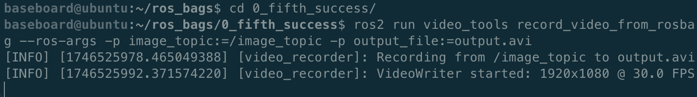
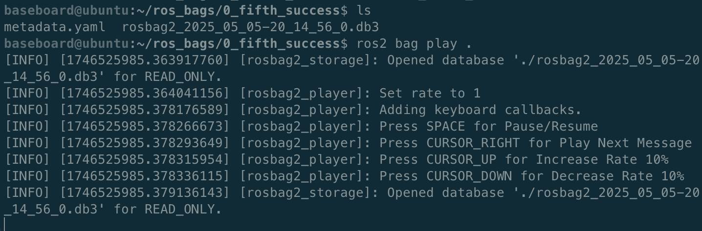

This guide describes how to use a custom Python ROS 2 node to record image topics from a rosbag into a video file. The node subscribes to an image topic, converts incoming images to OpenCV format using `cv_bridge`, and writes them to a video file with `cv2.VideoWriter`.

## Run the Video Recorder

**Window 1**: Start the `record_video_from_rosbag` node to listen to the image topic:

```
ros2 run vision_package record_video_from_rosbag --ros-args -p image_topic:=/image_topic -p output_file:=output.avi
```



**Window 2**: Navigate to the directory containing your rosbag and play it:

```
ros2 bag play .
```



## Stop the Recording

Once the rosbag finishes playing, press `Ctrl+C` in Window 1 to stop the node and finalize the video file.

## Convert to MP4 (Optional)

You can convert the resulting AVI file to MP4 using `ffmpeg`:

```bash
ffmpeg -i output.avi output.mp4
```
