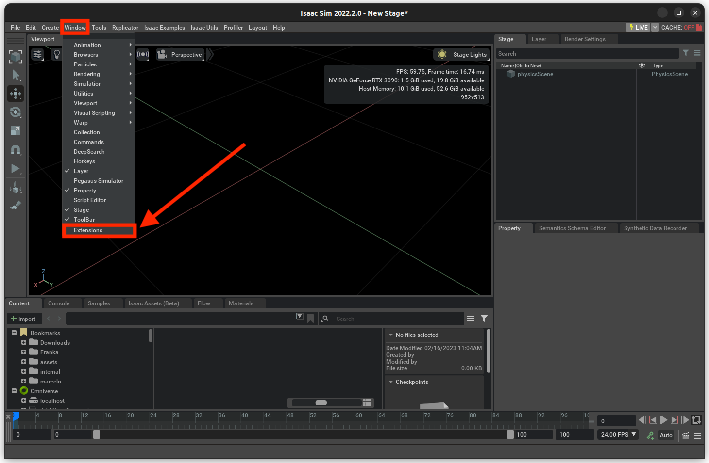
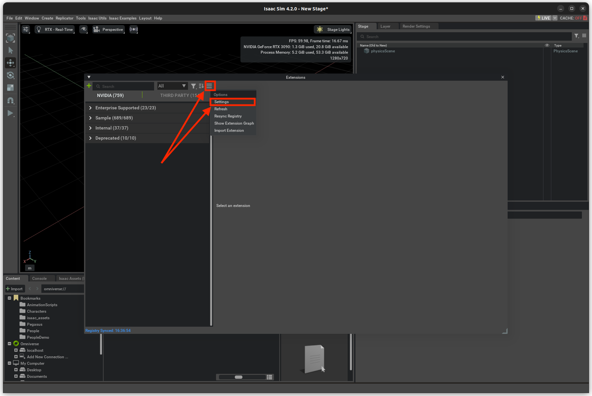
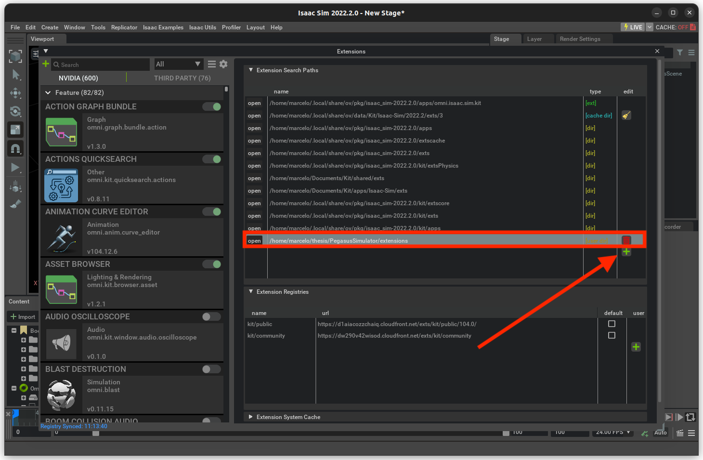
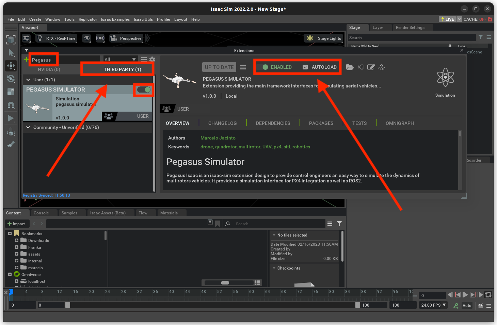
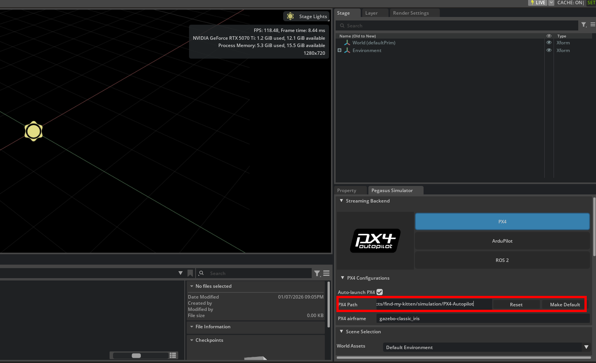

# Quick start

There is two ways to start developing this project further. First one is simpler and basically anybody can do it - a simulator. Second one is to build your own drone or use our existing setup, upload your code to it, and run test flights. In this page, both of these options are covered. Moreover, we have been working on a Docker development environment, information about that here as well.

## Nvidia Jetson initialization
Please refer to our [Jetson Orin setup guide](https://catscanners.github.io/find-my-kitten/Jetsons%20&%20Pixhawk/jetson-setup.html).

## ---- Simulator quick start (Windows or Linux) ----

This part guides the user on how to install a simulator, ROS2, find-my-kitten repository, QGroundControl, and run our main nodes on the system of consisting this software. <br/>
These instructions are similar to what you will find in the simulator docs at: ```docs/IsaacSim/Installing.md```

### Requirements
- The hardware and software system requirements specified in the README.md
- If you are already using a Nvidia Jetson -computer, please refer to the [Nvidia Jetson initialization](#jetson-initialization).
- Basic knowledge on ROS2. Please refer to our [ROS2 guide](https://catscanners.github.io/find-my-kitten/Jetsons%20&%20Pixhawk/ROS2%20Compiled%20Guide.html).

### Setup initial auxiliary software
Install necessary Ubuntu drivers by running: `sudo ubuntu-drivers install` <br/>

For docker containers you also have to install Nvidia Container Toolkit by running the following commands: <br/>
(commands taken from Nvidia docs at:
https://docs.nvidia.com/datacenter/cloud-native/container-toolkit/latest/install-guide.html) <br/>

```bash
sudo apt-get update && sudo apt-get install -y --no-install-recommends ca-certificates curl gnupg2
```

```bash
curl -fsSL https://nvidia.github.io/libnvidia-container/gpgkey | sudo gpg --dearmor -o /usr/share/keyrings/nvidia-container-toolkit-keyring.gpg \
  && curl -s -L https://nvidia.github.io/libnvidia-container/stable/deb/nvidia-container-toolkit.list | \
    sed 's#deb https://#deb [signed-by=/usr/share/keyrings/nvidia-container-toolkit-keyring.gpg] https://#g' | \
    sudo tee /etc/apt/sources.list.d/nvidia-container-toolkit.list
```

```bash
sudo apt-get update
```

```bash
export NVIDIA_CONTAINER_TOOLKIT_VERSION=1.18.2-1
  sudo apt-get install -y \
      nvidia-container-toolkit=${NVIDIA_CONTAINER_TOOLKIT_VERSION} \
      nvidia-container-toolkit-base=${NVIDIA_CONTAINER_TOOLKIT_VERSION} \
      libnvidia-container-tools=${NVIDIA_CONTAINER_TOOLKIT_VERSION} \
      libnvidia-container1=${NVIDIA_CONTAINER_TOOLKIT_VERSION}
```

<br/>


## Installing Isaac Sim

Run the following commands in terminal to install Isaac Sim:
```
# Go to the home directory
cd ~

# Create a new directory to store the Isaac Sim installation
mkdir -p isaacsim
cd isaacsim

# Download the zip file containing the Isaac Sim installation
wget https://download.isaacsim.omniverse.nvidia.com/isaac-sim-standalone-5.1.0-linux-x86_64.zip

# Unzip the file
unzip isaac-sim-standalone-5.1.0-linux-x86_64.zip

# Run the post-installation scripts, no need to select any options besides default
./post_install.sh
./isaac-sim.selector.sh

# Delete the zip file
rm isaac-sim-standalone-5.1.0-linux-x86_64.zip
```
Done :+1:<br />

## Setting environment variables

Add the following to your `~/.bashrc` file.
```
# ---------------------------
# ISAAC SIM SETUP
# ---------------------------
# Isaac Sim root directory
export ISAACSIM_PATH="${HOME}/isaacsim"
# Isaac Sim python executable
export ISAACSIM_PYTHON="${ISAACSIM_PATH}/python.sh"
# Isaac Sim app
export ISAACSIM="${ISAACSIM_PATH}/isaac-sim.sh"

# Define an auxiliary function to launch Isaac Sim or run scripts with Isaac Sim's python
# This is done to avoid conflicts between ROS 2 and Isaac Sim's Python environment
isaac_run() {

    # ------------------
    # === VALIDATION ===
    # ------------------
    if [ ! -x "$ISAACSIM_PYTHON" ]; then
        echo "❌ IsaacSim python.sh not found at: $ISAACSIM_PYTHON"
        return 1
    fi
    if [ ! -x "$ISAACSIM" ]; then
        echo "❌ IsaacSim launcher not found at: $ISAACSIM"
        return 1
    fi

    # -------------------------
    # === CLEAN ENVIRONMENT ===
    # -------------------------
    # Unset ROS 2 environment variables to avoid conflicts with Isaac's Python 3.11
    unset ROS_VERSION ROS_PYTHON_VERSION ROS_DISTRO AMENT_PREFIX_PATH COLCON_PREFIX_PATH PYTHONPATH CMAKE_PREFIX_PATH

    # Remove ROS 2 paths from LD_LIBRARY_PATH if present
    local ros_paths=("/opt/ros/humble" "/opt/ros/jazzy" "/opt/ros/iron")
    for ros_path in "${ros_paths[@]}"; do
        export LD_LIBRARY_PATH=$(echo "$LD_LIBRARY_PATH" | tr ':' '\n' | grep -v "^${ros_path}" | paste -sd':' -)
    done

    # -----------------------------
    # === UBUNTU VERSION CHECK ===
    # -----------------------------

    if [ -f /etc/os-release ]; then
        UBUNTU_VERSION=$(grep "^VERSION_ID=" /etc/os-release | cut -d'"' -f2)
    fi

    # If Ubuntu 24.04 -> use the Isaac Sim internal ROS2 Jazzy (ROS2 Jazzy bridge)
    if [[ "$UBUNTU_VERSION" == "24.04" ]]; then
        export ROS_DISTRO=jazzy
        export RMW_IMPLEMENTATION=rmw_fastrtps_cpp
        export LD_LIBRARY_PATH="${LD_LIBRARY_PATH}:${ISAACSIM_PATH}/exts/isaacsim.ros2.bridge/jazzy/lib"
        echo "🧩 Detected Ubuntu 24.04 -> Using ROS_DISTRO=jazzy"
    # If Ubuntu 22.04 -> use the Isaac Sim internal ROS2 Humble (ROS2 Humble bridge)
    else
        export ROS_DISTRO=humble
        export RMW_IMPLEMENTATION=rmw_fastrtps_cpp
        export LD_LIBRARY_PATH="${LD_LIBRARY_PATH}:${ISAACSIM_PATH}/exts/isaacsim.ros2.bridge/humble/lib"
        echo "🧩 Detected Ubuntu ${UBUNTU_VERSION:-unknown} -> Using ROS_DISTRO=humble"
    fi

    # ---------------------
    # === RUN ISAAC SIM ===
    # ---------------------
    if [ $# -eq 0 ]; then
        # No args → Launch full Isaac Sim GUI
        echo "🧠 Launching Isaac Sim GUI..."
        "${ISAACSIM}"

    elif [[ "$1" == --* ]]; then
        # Arguments start with "--" → pass them to Isaac Sim executable
        echo "⚙️  Launching Isaac Sim with options: $*"
        "${ISAACSIM}" "$@"

    elif [ -f "$1" ]; then
        # First argument is a Python file → run with Isaac Sim's Python
        local SCRIPT_PATH="$1"
        shift
        echo "🚀 Running Python script with Isaac Sim: $SCRIPT_PATH"
        "${ISAACSIM_PYTHON}" "$SCRIPT_PATH" "$@"

    else
        # Unrecognized input
        echo "❌ Unknown argument or file not found: '$1'"
        echo "Usage:"
        echo "  isaac_run                 → launch GUI"
        echo "  isaac_run my_script.py    → run script with IsaacSim Python"
        echo "  isaac_run --headless ...  → launch IsaacSim with CLI flags"
        return 1
    fi
}
```

Test the current environment by running `isaac_run` in terminal. This should open a new window running Isaac Sim.

Test that the Isaac Sim python interpreter path variable is correct by running in the terminal:</br> 
`$ISAACSIM_PYTHON ${ISAACSIM_PATH}/standalone_examples/api/isaacsim.core.api/add_cubes.py`</br>

## Installing project dependencies

For this repository, do not manually install Python dependencies one by one. Use `uv` to sync the environment from the project configuration:

```bash
cd find-my-kitten
uv sync
source .venv/bin/activate
```

## Installing Pegasus Simulator extension
1. Launch Isaac Sim with `isaac_run` in terminal.
2. Open the Window->extensions on the top menubar inside Isaac Sim. <br>
<br>
3. On the Extensions manager menu, we can enable or disable extensions. By pressing the settings button, we can add a path to the Pegasus-Simulator repository.<br>
<br>
4. The path inserted should be the path to the repository followed by /extensions.<br>
<br>
5. After adding the path to the extension, we can enable the Pegasus Simulator extension on the third-party tab. Enable AUTOLOAD.<br>
<br>

## Installing the extension as a library

In order to be able to use the Pegasus Simulator API from python scripts and standalone apps, we must install this extension as a pip python module for the built-in ISAACSIM_PYTHON to recognize. For that, run:

```
# Go to the repository of the pegasus simulator
cd PegasusSimulator

# Go into the extensions directory
cd extensions

# Run the pip command using the built-in python interpreter
$ISAACSIM_PYTHON -m pip install --editable pegasus.simulator
```

## Building PX4-Autopilot

PX4-Autopilot is included in this repository at `simulation/PX4-Autopilot`.

After entering that directory, build SITL with:

```bash
cd find-my-kitten/simulation/PX4-Autopilot
make px4_sitl
```

## Setting PX4 Path

Running a simulation with Isaac Sim and Pegasus Simulator requires the path for PX4-Autopilot to be set in Pegasus Simulator configurations.



The input field can be found in the bottom right of Isaac Sim in the Pegasus Simulator tab, under `PX4 Configurations`.

Set the value to the path of your PX4-Autopilot directory, for our purposes we can use the directory in this repository's simulation directory: <br/>
`find-my-kitten/simulation/PX4-Autopilot`

Press `Make Default` next to the path input field.

### Setup toolchain

First, let's set up the toolchain:
1. Install the **PX4 toolchain** as per [PX4 Toolchain Guide](https://docs.px4.io/main/en/dev_setup/dev_env.html). If QGroundControl is not working for you, [here](https://catscanners.github.io/find-my-kitten/QGroundControl%20&%20Drone/) guidance on how to proceed with the steps requiring QGroundControl. If there are any problems when installing PX4-Autopilot, refer to the Common problems -section.
2. Install **ROS2** and **Micro-XRCE** as per [PX4 ROS2 Guide](https://docs.px4.io/main/en/ros2/user_guide.html).
3. Use our [custom simulation markdown](https://github.com/CatScanners/find-my-kitten/blob/main/simulation/instructions.md) / [custom simulation website documentation](https://catscanners.github.io/find-my-kitten/Simulation%20&%20flight%20analysis/Simulation%20setup.html) setup.
4. Clone our **find-my-kitten** repository:
`
git clone https://github.com/CatScanners/find-my-kitten
`
5. Make any changes to any of the packages inside **ros2_ws**-folder, or create new ones. Please refer to [ROS2 documentation](https://docs.ros.org/en/humble/index.html). Shortly: change the code, `colcon build`, and `source install/setup.bash`. 


### Simulation startup 
1. Open up a **QGroundControl** window.
2. Run the **XRCE-agent**: `MicroXRCEAgent udp4 -p 8888`.
3. Start the simulation: 
- To start the simulation: `make px4_sitl gz_x500_baylands`
- To start the simulation camera bridge: `ros2 run ros_gz_image image_bridge /camera`.
4. From QGroundControl, **arm** and **takeoff**. If you don't have QGC, please refer to the Common problems -section.


### Building and Running the simulator inside docker container

### Setup

Before running the simulation inside a container, you'll first have to start the container and build ros2 by following the following steps: <br/>

```bash
./start_isaac_dev.sh -sc
```

NOTE: If after the last command you get an error and the message: "have you initialized submodules?", circle back to the git-lfs section of [Initial setup](#initial-setup)

If the script runs without errors, then you will notice that it starts the docker container. This step will take around 30 minutes, so you'll have to wait a while. <br/>

After you have successfully started the container, cd into /ros2_ws in the container, and build the package by running: <br/>

```bash
colcon build
```

After building, return to the parent directory and run the following list of commands (You can copy paste all of them at once into the terminal and press enter):

```bash
cd /home/admin/isaacsim/
./post_install.sh
./isaac-sim.selector.sh
source ~/.bashrc
cd /workspaces/isaac_ros-dev
sudo apt update
sudo apt install libcanberra-gtk-module libcanberra-gtk3-module
uv sync
uv add smmap gitpython numpy scipy
source .venv/bin/activate
sudo chown -R admin:admin /home/admin/PegasusSimulator
export ISAACSIM_PYTHON=/home/admin/isaacsim/python.sh
export ISAACSIM_PATH=/home/admin/isaacsim
$ISAACSIM_PYTHON -m pip install --editable /home/admin/PegasusSimulator/extensions/pegasus.simulator
cd ros2_ws
source install/setup.bash
source /opt/ros/humble/setup.bash
```

**When runnin these commands, you should get a small GUI pop-up that is the setup for the simulator UI.<br/>
In this window, Just press the large green button at the bottom, wait for a larger UI to open, and then you can close both GUI's and go to the next step. <br/>**

<br/>

#### Running the simulator

After the last series of commands, you should be at the path: `/workspaces/isaac_ros-dev/ros2_ws` <br/>
In this folder, you can start the simulation by running the following command: <br/>
`ros2 launch kitten_sim kitten_sim.launch.py`

** NOTE: You can also run the simulator outside of the docker container by omitting the 
initial ./start_isaac_dev.sh -sc   command, but YOu have to make sure that your directory names 
are the same OR you change the code accordingly**

If you want to run the simulator outside of the docker container, run the following command series instead of the ones given before:
```bash
source ~/.bashrc
cd /workspaces/isaac_ros-dev
sudo apt update
sudo apt install libcanberra-gtk-module libcanberra-gtk3-module
uv sync
uv add smmap gitpython numpy scipy
source .venv/bin/activate
sudo chown -R admin:admin /home/admin/PegasusSimulator
export ISAACSIM_PYTHON=/home/admin/isaacsim/python.sh
export ISAACSIM_PATH=/home/admin/isaacsim
$ISAACSIM_PYTHON -m pip install --editable /home/admin/PegasusSimulator/extensions/pegasus.simulator
cd ros2_ws
source install/setup.bash
source /opt/ros/humble/setup.bash
```


### Machine vision startup
1. IMPORTANT. On drone startup make sure that all connected cameras are visible. This can be done with command `ls /dev/ | grep video`. If you have only the arducam globalshutter camera connected, you should only see /dev/Video0. 
If you've connected the Zed depth camera, you should see three cameras: /dev/Video0 ...Video1 and ...Video2 (Depth camera has two video feeds). If you only see two or no cameras, powercycle the drone. The arducam uses custom drivers which if not loaded properly means it will not show up nor work.  
2. Build and source our ros2 packages. Otherwise `ros2 run vision_package ...` will result in package not found. To build run `colcon build` and after building run `source install/setup.bash`. This should be done inside folders `ros2_ws` or `ros2_ws/src` to build all packages. 
3. Run the camera publishing node. For a regular USB / CSI camera use `ros2 run vision_package image_publisher` and if you are using an arducam globalshutter camera run `ros2 run vision_package arducam_publisher.py`. These fill publish video frames to a ros2 topic called image_topic. You can check if the node is working and topic is visible with `ros2 topic list`.
4. Run the object detection node. Command compatible with offboard_control is `ros2 run vision_package object_detector.py --ros-args -p input_topic_name:="camera" -p output_topic_name:="detections"`.
5. To preview the image stream you can run `ros2 run vision_package image_subscriber` node. This brings up an window which displays the video feed from topic `image_topic`.

### Actions startup
1. Start a node receiving offboard messages and then sending those periodically to PX4 simulator. `ros2 run px4_handler offboard_control`. By default just sends current coordinates.
2. Turn on offboard node from QGroundControl. Now the drone is flying with our ROS2 messges, currently just staying in its current position. Again, if you don't have QGC, please refer to the Common problems -section.
3. If you haven't already, star vision package to detect the ball.
`ros2 run vision_package object_detector.py --ros-args -p input_topic_name:="camera" -p output_topic_name:="detections"`
4. a - Start ballfinder node to start searching for the ball:
`ros2 run px4_handler ball_finder.py`, or b - Start predefined motions with two speeds: `ros2 run px4_handler hard_motions.py`.
5. a - With default code, the drone should search an area of 8m x 12m and stop and go a bit down when it sees a **sports ball**, or b - Does a few predefined motions in two different speeds.


## ---- Real life quick start (Jetson baseboard + PX6 + drone) ----

This part guides the user on how to setup the actual drone and how to connect a Holybro Pixhawk Jetson Baseboard into it, the installation of all the relevant software. If you already have our pre-built drone with the baseboard, feel free to skip until the "Running the software part". This part also includes information about necessary permissions and who is actually allowed to fly the drone in Finland.

### Requirements
- Knowledge of Linux.
- [Holybro Pixhawk Jetson Baseboard](https://docs.px4.io/main/en/companion_computer/holybro_pixhawk_jetson_baseboard.html)
- Drone frame
- Something else?

### Setting up the Holybro Pixhawk Jetson Baseboard

To set up the baseboard, please follow this [guide](https://catscanners.github.io/find-my-kitten/Jetsons%20&%20Pixhawk/jetson-setup.html) of ours. It has a link to the official guide on setting up the baseboard, and also the deviations from the official material. It also includes steps for initializing a Jetson Orin Nano Devkit, which might be helpful.

### Setting up the drone

Assembly follows the [HolyBro X500v2 guide](https://docs.holybro.com/drone-development-kit/px4-development-kit-x500v2) with Jetson and Pixhawk setup as mentioned above.

### Fly in real life

1. Build the drone, refer to the [Setting up the drone](#setting-up-the-drone).
2. Set up the Holybro Pixhawk Jetson Baseboard that is on the drone with our [guide](#setting-up-the-holybro-pixhawk-jetson-baseboard)
3. Do all the real-life overhead related to flying a drone:
- Refer to [this comprehensive guide](https://docs.google.com/document/d/1DUjyzkbAegfWW_M4UNErEH7ssDJYN7t6NvSwmUnFjBE/edit?pli=1&tab=t.0#heading=h.qy87xqej0dgz).
4. Arm, takeoff and fly with position/altitude mode in QGroundControl with your controller. Then, switch to offboard mode and run the same scripts as with [machine vision](#machine vision) and [actions startup](#actions-startup).

## Docker setup

We provide a Dockerfile and instructions for the simulation [here](https://github.com/CatScanners/find-my-kitten/blob/main/simulation/instructions.md). The section in Isaac ROS in the [Jetson Orin setup guide](https://catscanners.github.io/find-my-kitten/Jetsons%20&%20Pixhawk/jetson-setup.html) further covers Docker usage elsewhere.
