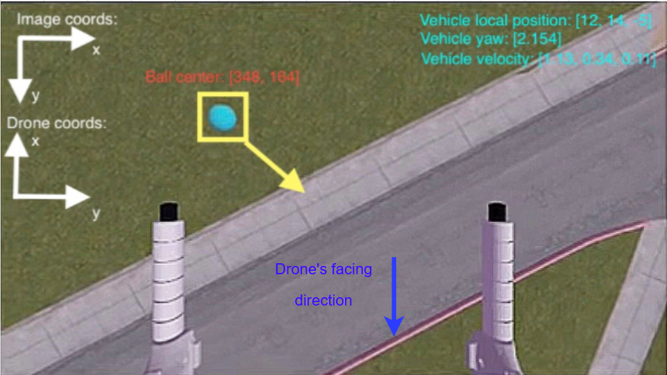
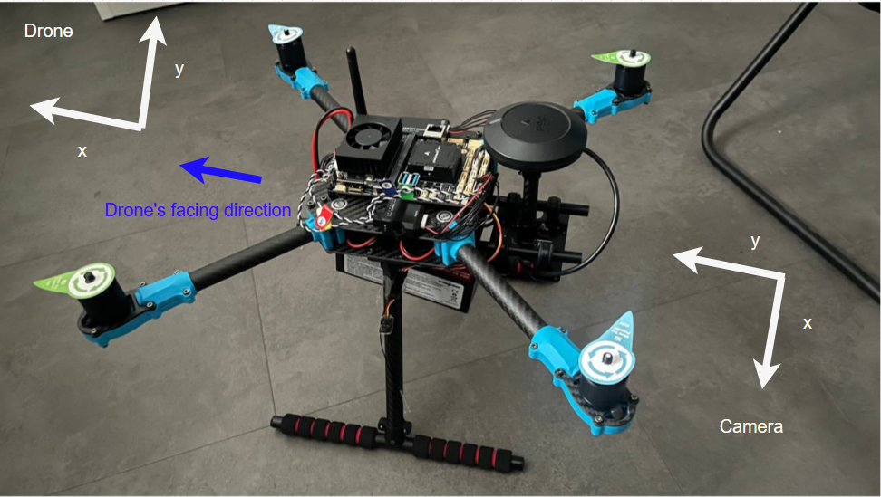

**Note:** The coordinate systems used in the Gazebo simulator and in real-world applications (NED) differ slightly, as shown in the images below.

# Coordinate System in Gazebo Simulator

- Used in the `go_on_top()` method  
- Found in the `Maneuver` class (in `ball_finder.py`)

# Coordinate System in Real Life (NED)

- Used in the `go_on_top2()` method  
- Found in the `Maneuver` class (in `ball_finder.py`)