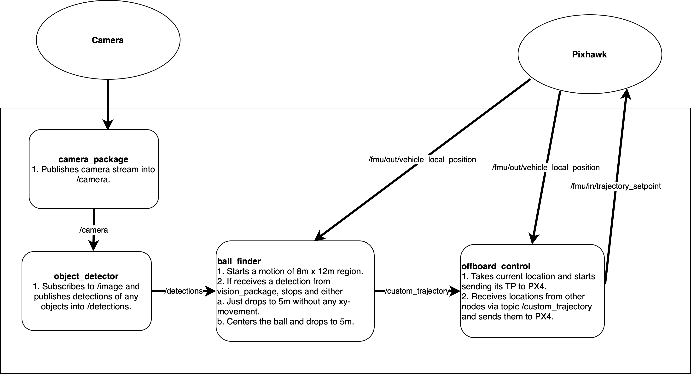

# Technical Overview

This subpage is divided into several pieces: Jetson, Drone and Miscellaneous. These pieces describe their own technical architectures separately, though always informing the reader about their connections. If interested, please take a lookt at the technical overview report [here](../assets/Technical%20Overview.pdf).

## Jetson
The Jetson baseboard consists of a ROS2-system with four nodes. They are following with the following tasks:
- offboard_control (pkg: px4_handler)
  - Subsribes to `/fmu/out/vehicle_local_position`
  - Publishes to `/fmu/in/trajectory_setpoint`
- ball_finder (pkg: px4_handler)
  - Subsribes to `/fmu/out/vehicle_local_position`
  - Publishes to `/custom_trajectory`
- object_detector (pkg: vision_package)
  - Subsribes to `/image`
  - Publishes to `/detections`

## Drone
PX4 + the rtk stuff and the qgroundcontrol

## Miscellaneous
simulation? ulog?
