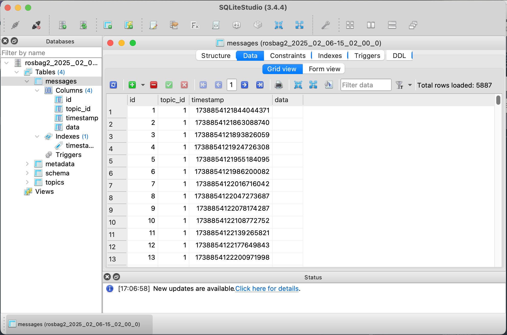
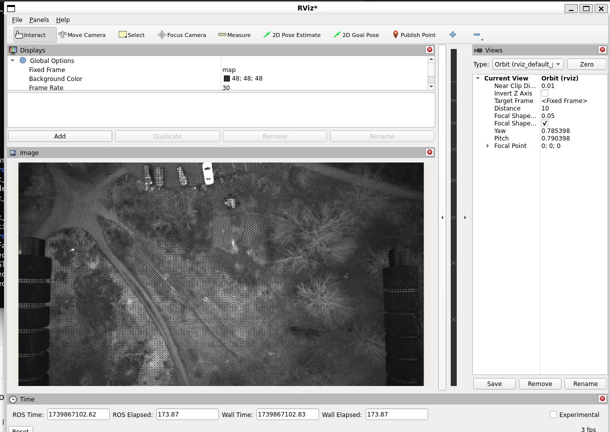

# Report: ROS2 Recording System and Corrupted Database Recovery

## Introduction
The **ROS2 recording system** (via `rosbag2`) is designed to capture and store messages exchanged between various nodes in a ROS2 environment. It is used for purposes such as logging sensor data, debugging, or replaying data during development. The format is versatile, allowing different storage backends, and in this case, the database uses SQLite3, which is efficient for handling large datasets.

## Location of Recorded ROS Bags
All of the recorded **ros bags** are located on the following path:  
**`~/find-my-kitten/ros2_ws/src/vision_package/rosbag/`**  
on the machine **baseboard@82.130.11.125**.

## ROS2 Interaction with the Recording System
1. **Recording Data**:  
   The database file **"rosbag2_2025_02_06-15_02_00_0.db3"** holds sensor data in the form of **images** captured from the `/image_topic`. The `rosbag2` system records messages of type `sensor_msgs/msg/Image`, writing them to the SQLite3 database. This recording spans **179.79 seconds**, from **17:02:01** to **17:05:01**, with a total of **5,887 messages**.

   **Bag File Information** (as generated by the command `ros2 bag info .`):  
   ```
   Files:             rosbag2_2025_02_06-15_02_00_0.db3
   Bag size:          34.1 GiB
   Storage id:        sqlite3
   Duration:          179.789623028s
   Start:             Feb  6 2025 17:02:01.844044371 (1738854121.844044371)
   End:               Feb  6 2025 17:05:01.633667399 (1738854301.633667399)
   Messages:          5887
   Topic information: Topic: /image_topic | Type: sensor_msgs/msg/Image | Count: 5887 | Serialization Format: cdr
   ```

2. **Metadata Information**:  
   The associated **metadata.yaml** provides key details:
   - **Message Count**: 5,887 messages recorded for the `/image_topic`.
   - **Serialization Format**: **CDR (Common Data Representation)**, which is a compact binary format used for efficient storage.
   - **Quality of Service (QoS)**: Profiles such as message history, durability, and reliability are specified.

   You can find the metadata in the **metadata.yaml** file:
   ```
   rosbag2_bagfile_information:
     version: 5
     storage_identifier: sqlite3
     duration:
       nanoseconds: 179789623028
     starting_time:
       nanoseconds_since_epoch: 1738854121844044371
     message_count: 5887
     topics_with_message_count:
       - topic_metadata:
           name: /image_topic
           type: sensor_msgs/msg/Image
           serialization_format: cdr
           offered_qos_profiles: "- history: 3\n  depth: 0\n  reliability: 1\n  durability: 2\n  deadline:\n    sec: 9223372036\n    nsec: 854775807\n  lifespan:\n    sec: 9223372036\n    nsec: 854775807\n  liveliness: 1\n  liveliness_lease_duration:\n    sec: 9223372036\n    nsec: 854775807\n  avoid_ros_namespace_conventions: false"
         message_count: 5887
     compression_format: ""
     compression_mode: ""
     relative_file_paths:
       - rosbag2_2025_02_06-15_02_00_0.db3
     files:
       - path: rosbag2_2025_02_06-15_02_00_0.db3
         starting_time:
           nanoseconds_since_epoch: 1738854121844044371
         duration:
           nanoseconds: 179789623028
         message_count: 5887
   ```

3. **Storage Format**:  
   The database utilizes **SQLite3** to store the messages. This backend was chosen for its ability to handle large amounts of data and facilitate easy querying.



4. **File Storage**:  
   The bag file is stored as `rosbag2_2025_02_06-15_02_00_0.db3`. This file contains both the **video data** (in the `data` column as BLOBs) and relevant metadata, including timestamps and topic names.

5. **Topics and Messages**:  
   The **/image_topic** is the primary data stream in this recording. The recorded **sensor_msgs/msg/Image** messages represent images captured by a camera in the system, providing video footage of the recorded duration.

6. **Replay and Analysis**:  
   The stored bag file can be used to **replay** the messages on another ROS2 system, allowing for debugging, sensor behavior analysis, and simulation without requiring real-time data.

   **Command to replay the bag file**:  
   ```bash
   ros2 bag play rosbag2_2025_02_06-15_02_00_0.db3
   ```

## Corrupted Database and Repair Process
The database file **rosbag2_2025_02_06-14_06_02_0.db3** was found to be corrupted during an import attempt. Initially, it was thought to be missing metadata, but further investigation revealed that the database itself was damaged.


To ensure that other members can also reproduce this process, the corrupted file, along with a pair of intact files and their metadata, have been securely transferred to a local machine via SCP. The files have not been modified in any way.

A solution was found on **Stack Overflow** involving a Bash script to repair the corrupted SQLite3 database. The script works as follows:
- It generates a SQL dump of the database, excluding any **ROLLBACK** statements.
- A `COMMIT;` statement is appended to ensure all changes are finalized.
- The cleaned SQL dump is then written to a new database file (`fix_$1`).

Here’s the repair solution:  
[SQLite3 database or disk is full / the database disk image is malformed](https://stackoverflow.com/a/15874884/2353444)

**Bash script to repair the corrupted database**:  
```bash
#!/bin/bash

# Provide the corrupted database file as the first argument
cat <( sqlite3 "$1" .dump | grep "^ROLLBACK" -v ) <( echo "COMMIT;" ) | sqlite3 "fix_$1"
```

## Slowness in Repair Process
The repair process is taking an extended amount of time due to several factors:
1. **Large Database Size**: The database is 67GB, which means the process of reading and filtering the data takes time.
2. **Rebuilding Process**: After filtering the SQL dump, the insertion of data back into a new database is a time-consuming operation, especially for such a large file.
3. **Disk I/O**: The speed of the repair depends heavily on the storage device. If using an SSD, the repair could take **2–6 hours**, but on an HDD, it may take **10+ hours**, potentially stretching over a day.

**Command to run the repair script**:
```bash
chmod +x repair_db.sh  # Make the script executable
./repair_db.sh rosbag2_2025_02_06-14_06_02_0.db3  # Run the script with the corrupted database
```

## Updates and Further Attempts

Based on the database's state, the metadata file was updated:

- `nanoseconds_since_epoch`: Timestamp of the last entry.
- `duration`: Time difference between the last and first entries.
- `message_count`: Total number of entries.

After modifying the metadata to reflect accurate timestamps and message counts, I securely transferred the repaired database to the remote machine via SCP, renaming the old file just in case. Then I attempted to play the bag video over a remote connection but encountered issues. The steps taken to troubleshoot included:

1. **Publishing a Simple String**: Debugging by publishing a string message showed that my local machine (as a subscriber) was not listening to the published topic on the remote machine.
   ```bash
   ros2 topic pub /test std_msgs/String "data: test"
   ```
2. **Setting Up Remote ROS 2 Environment**:
   I set up the remote ROS 2 environment as follows:
   ```bash
   export ROS_DOMAIN_ID=42
   export ROS_IP=<your_ip>  # local and remote ip correspondingly
   export ROS_HOSTNAME=<your_local_ip>
   ```
3. **Router Port Forwarding**:
   I configured a port forwarding rule for port `11311` on my router.
4. **DDS Implementation Consistency**:
   I set both machines to use the same DDS implementation:
   ```bash
   export RMW_IMPLEMENTATION=rmw_fastrtps_cpp
   ```

Despite these efforts, I couldn’t play the video. Fortunately, we are a team. After collaborating with Kaius, we confirmed that the video located in `~/find-my-kitten/ros2_ws/src/vision_package/rosbag/rosbag2_2025_02_06-14_06_0` was repaired and could now be played:



## References

- [RViz User Guide](https://docs.ros.org/en/rolling/Tutorials/Intermediate/RViz/RViz-User-Guide/RViz-User-Guide.html)
- [RoboStack installation](https://robostack.github.io/GettingStarted.html)
