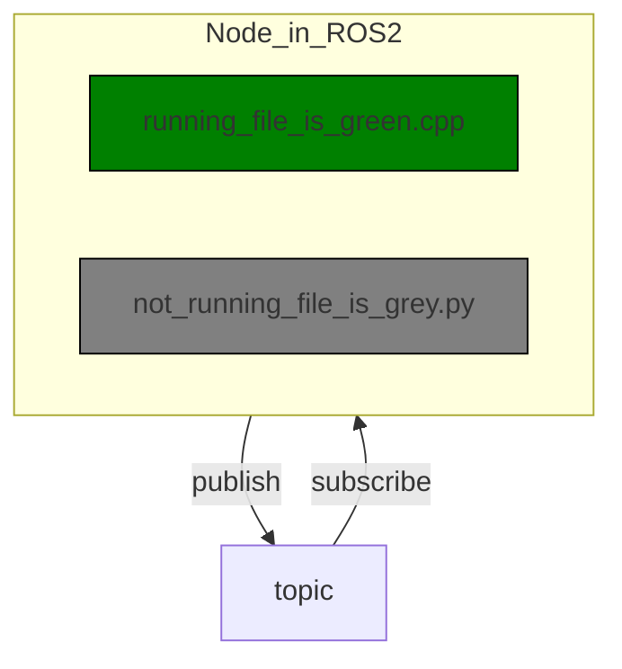
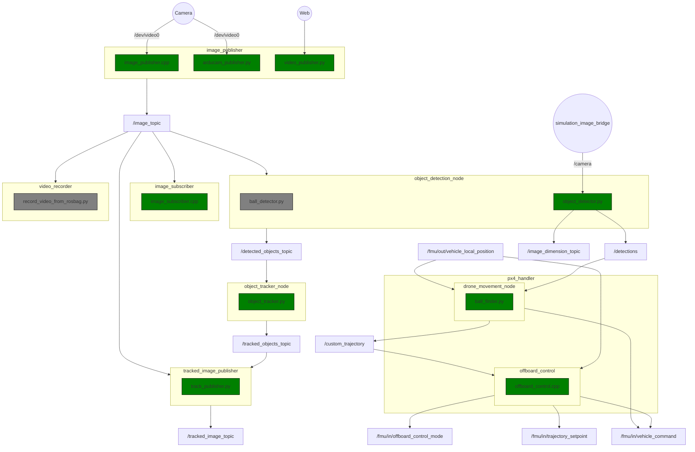

# Software architecture diagram

This Markdown file contains different architecture diagrams for the project, and it should replace some outdated documentation by the previous team (CatScanner 2024-2025). 
Currently, we use [Markdown Preview Mermaid Support by Matt Bierner](https://marketplace.visualstudio.com/items?itemName=bierner.markdown-mermaid) to simplify the creation process. After installing the extension, the diagram will be shown in the preview.

If you cannot install the extension for some reason, you can download another Mermaid-compatible extension and modify the code manually to match the format.

If you are new to Mermaid and want to get familiar with it, please check the [Youtube video by PetterTech](https://www.youtube.com/watch?v=qGsQolMh9zE), [Youtube video by Red Gregory](https://www.youtube.com/watch?v=-XV1JBfhgWo&list=PLw5h0DiJ-9PC49ItLKBQlWSMH1zolOCXS), or [The official documentation by mermaid.js.org](https://mermaid.js.org/syntax/flowchart.html).

## Changelog

| Date | Changes |
| :-- | :-- |
| 2026-01-09 | Add ROS2 node architecture diagram |

## 1. Relationship between different ROS2 nodes

### Guide

Green: Files that are included in CMakeList.txt.

Gray: Files that are not compiled in CMakeList.txt (legacy code, testing, debug, etc).
### Diagram

